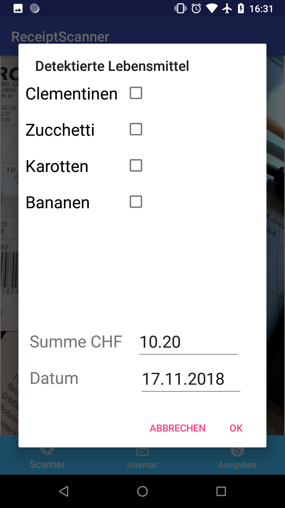

# Foodventory - a mobile on-device receipt scanner

An Android app for scanning receipts with food items and keeping track of food stocks

The app is able to scan receipts from grocery shopping and detects food items on the receipt and stores them in a database. The text recognition is based on the [Firebase ML kit](https://firebase.google.com/docs/ml-kit/recognize-text) (on-device recognition) combined with a string similarity measure based on the Levenshtein edit distance to match potentially flawed text recognition results to known food items. 
Besides the names of the food items themselves, the app also recognizes the total expense on the receipts and presents a history of the expenses. 

The stored food item names are currently in German, for use in other languages, please place the names of the food items you want to recognize in the string array `food_names` in the `res/values/strings.xml` file. 

In order to run the app, you have to place your own google-services.json file in the /app folder as explained [here](https://developers.google.com/android/guides/google-services-plugin#adding_the_json_file). 

Here are some screenshots of the app usage:   

## Scanning a receipt

## Selecting the correct items

## The expense overview

## The food inventory

